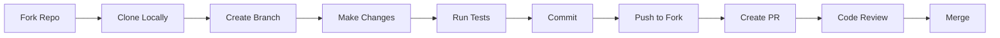

# 🏡 Smart Rent System

<div align="center">
  
</div>

**Revolutionizing the rental experience through technology and community**

[](https://swoc.tech)
[](https://github.com/hitesh-kumar123/Smart-Rent/graphs/contributors)
[](https://github.com/hitesh-kumar123/Smart-Rent/stargazers)
[](https://github.com/hitesh-kumar123/Smart-Rent/issues)
[](LICENSE)
[](https://github.com/hitesh-kumar123/Smart-Rent/commits)

[🚀 Live Demo](https://smartrentsystem.netlify.app/) • [📖 Documentation](#) • [🐛 Report Bug](https://github.com/hitesh-kumar123/Smart-Rent/issues) • [✨ Request Feature](https://github.com/hitesh-kumar123/Smart-Rent/issues)

</div>

---

## 📋 Table of Contents

<details open>
<summary>Click to expand</summary>

- [🎯 Vision](#-vision)
- [✨ Features](#-features)
- [🛠️ Technology Stack](#️-technology-stack)
- [📸 Screenshots](#-screenshots)
- [🚀 Quick Start](#-quick-start)
- [📚 Project Structure](#-project-structure)
- [🔧 Configuration](#-configuration)
- [🤝 Contributing](#-contributing)
- [🗺️ Roadmap](#️-roadmap)
- [👥 Community](#-community)
- [📄 License](#-license)
- [🙏 Acknowledgments](#-acknowledgments)

</details>

---

## 🎯 Vision

Smart Rent System is more than a rental platform—it's a **movement towards smarter, more transparent property transactions**. Built with modern web technologies and best practices, we're creating a space where property owners and travelers connect seamlessly.

### 🌍 Our Mission

```
Democratize property rentals by building an open-source platform that:
✓ Prioritizes user experience and security
✓ Fosters trust through verified reviews
✓ Empowers developers to learn and contribute
✓ Creates economic opportunities for hosts worldwide
```

### 🎓 Learning Hub

As part of **Social Winter of Code (SWoC) 2026**, Smart Rent System serves as a comprehensive learning resource for developers mastering the MERN stack. Dive into real-world implementations of:

- **RESTful API Design** with Express.js
- **State Management** using Redux Toolkit
- **Real-time Communication** with WebSockets
- **Cloud Storage** integration with Cloudinary
- **Authentication Flows** including OAuth 2.0
- **Database Modeling** for complex relationships

---

## ✨ Features

<table>
<tr>
<td width="50%">

### 🔐 **Secure Authentication**
- JWT-based session management
- Google OAuth integration
- Password encryption with bcrypt
- Role-based access control (RBAC)

### 🏠 **Smart Listings**
- Rich media uploads (Cloudinary CDN)
- Dynamic pricing algorithms
- Amenities and house rules editor
- Availability calendar integration

### 🗺️ **Map Integration**
- Interactive Leaflet.js maps
- Geolocation-based search
- Radius filtering
- Custom map markers

</td>
<td width="50%">

### 💬 **Real-Time Chat**
- Socket.io powered messaging
- Typing indicators
- Read receipts
- Message history persistence

### 📊 **Analytics Dashboard**
- Booking statistics
- Revenue tracking
- Occupancy rates
- User engagement metrics

### ⭐ **Review System**
- Verified guest reviews
- Rating aggregation
- Photo reviews
- Response management

</td>
</tr>
</table>

---

## 🛠️ Technology Stack

<div align="center">

### Frontend Arsenal


### Backend Infrastructure


### Database & Storage


### Development Tools


</div>

---

## 📸 Screenshots

<details>
<summary>🖼️ View Application Screenshots</summary>

### Landing Page


### Property Listings


### Interactive Map


### Real-Time Chat


</details>

---

## 🚀 Quick Start

### Prerequisites

Before you begin, ensure you have the following installed:

```bash
node -v  # v16.0.0 or higher
npm -v   # v8.0.0 or higher
```

You'll also need:
- **MongoDB** (local installation or Atlas URI)
- **Cloudinary Account** (free tier available)
- **Git** for version control

### Installation

**1. Clone the Repository**

```bash
git clone https://github.com/hitesh-kumar123/Smart-Rent-System.git

```

**2. Backend Setup**

```bash
cd backend
npm install
```

Create `.env` file in the `backend` directory:

```env
# Server Configuration
PORT=8000
NODE_ENV=development

# Database
MONGO_URL=mongodb://localhost:27017/smartrent

# Authentication
JWT_SECRET=your_super_secret_jwt_key_change_in_production
JWT_EXPIRE=7d

# Cloudinary Configuration
CLOUDINARY_CLOUD_NAME=your_cloud_name
CLOUDINARY_KEY=your_api_key
CLOUDINARY_SECRET=your_api_secret

# Google OAuth (Optional)
GOOGLE_CLIENT_ID=your_google_client_id
GOOGLE_CLIENT_SECRET=your_google_client_secret
```

**3. Frontend Setup**

```bash
cd ../frontend
npm install
```

Create `.env` file in the `frontend` directory:

```env
REACT_APP_API_URL=http://localhost:8000/api
REACT_APP_SOCKET_URL=http://localhost:8000
```

**4. Launch Application**

**Terminal 1 - Backend:**
```bash
cd backend
npm run server
```

**Terminal 2 - Frontend:**
```bash
cd frontend
npm run dev
```

**5. Access the Application**

Open your browser and navigate to:
```
http://localhost:3000
```

🎉 **Congratulations!** Smart-Rent is now running locally.

---

## 📚 Project Structure

```
Smart-Rent/
├── backend/
│   ├── config/              # Configuration files
│   ├── controllers/         # Request handlers
│   ├── middleware/          # Custom middleware
│   ├── models/              # Mongoose schemas
│   ├── routes/              # API routes
│   ├── utils/               # Helper functions
│   └── server.js            # Entry point
│
├── frontend/
│   ├── public/              # Static assets
│   ├── src/
│   │   ├── components/      # Reusable components
│   │   ├── pages/           # Page components
│   │   ├── redux/           # State management
│   │   ├── services/        # API services
│   │   ├── utils/           # Utility functions
│   │   └── App.js           # Root component
│   └── package.json
│
├── assets/                  # Project assets
├── docs/                    # Documentation
├── .gitignore
├── CONTRIBUTING.md
├── LICENSE
└── README.md
```

---

## 🔧 Configuration

### Environment Variables Reference

| Variable | Description | Required | Default |
|----------|-------------|----------|---------|
| `PORT` | Backend server port | ✅ | 8000 |
| `MONGO_URL` | MongoDB connection string | ✅ | - |
| `JWT_SECRET` | Secret key for JWT signing | ✅ | - |
| `CLOUDINARY_CLOUD_NAME` | Cloudinary cloud name | ✅ | - |
| `CLOUDINARY_KEY` | Cloudinary API key | ✅ | - |
| `CLOUDINARY_SECRET` | Cloudinary API secret | ✅ | - |

### API Documentation

Once the backend is running, access API documentation at:
```
http://localhost:8000/api-docs
```

---

## 🤝 Contributing

We ❤️ contributions! Smart-Rent is an open-source project built for **Social Winter of Code (SWoC) 2026**.

### How to Contribute

**1. Find an Issue**
- Browse [existing issues](https://github.com/hitesh-kumar123/Smart-Rent-System/issues)
- Look for labels: `good first issue`, `help wanted`, `enhancement`

**2. Fork & Create Branch**
```bash
# Fork the repository (click Fork button on GitHub)

# Clone your fork
git clone https://github.com/hitesh-kumar123/Smart-Rent-System.git
# Create a feature branch
git checkout -b feature/amazing-feature
```

**3. Make Changes**
```bash
# Make your changes
# Follow our coding standards (ESLint + Prettier)

# Test your changes
npm test
```

**4. Commit & Push**
```bash
# Commit with descriptive message
git commit -m "Add: Implement amazing feature"

# Push to your fork
git push origin feature/amazing-feature
```

**5. Create Pull Request**
- Go to your fork on GitHub
- Click "New Pull Request"
- Fill out the PR template
- Wait for review 🎉

### Contribution Guidelines

📖 Read our [CONTRIBUTING.md](CONTRIBUTING.md) for detailed guidelines including:
- Code style and formatting
- Commit message conventions
- Testing requirements
- Documentation standards

### Development Workflow



---

## 🗺️ Roadmap

### ✅ Phase 1 - Foundation (Completed)
- [x] Project scaffolding and architecture
- [x] User authentication system
- [x] Basic CRUD operations for listings
- [x] Responsive UI with Tailwind CSS

### 🚧 Phase 2 - Core Features (In Progress)
- [x] Map integration with Leaflet.js
- [] Real-time chat with Socket.io
- [ ] Advanced search and filtering
- [ ] Booking calendar with conflict resolution
- [ ] Review and rating system

### 🔮 Phase 3 - Advanced Features (Planned)
- [ ] Payment gateway integration (Stripe/Razorpay)
- [ ] Email notifications (SendGrid/Nodemailer)
- [ ] Admin dashboard with analytics
- [ ] Multi-language support (i18n)
- [ ] Progressive Web App (PWA)

### 🌟 Phase 4 - Optimization (Future)
- [ ] Performance optimization (lazy loading, code splitting)
- [ ] SEO optimization
- [ ] Automated testing (Jest, Cypress)
- [ ] CI/CD pipeline (GitHub Actions)
- [ ] Mobile native apps (React Native)

**Want to influence the roadmap?** [Share your ideas](https://github.com/hitesh-kumar123/Smart-Rent-System/discussions)

---

## 👥 Community

<div align="center">

### 🌟 Project Maintainers

<table>
  <tr>
    <td align="center">
      <a href="https://github.com/hitesh-kumar123">
        
        <br />
        <sub><b>Hitesh Kumar</b></sub>
      </a>
      <br />
      <sub>Project Admin 🚀</sub>
    </td>
  </tr>
</table>

### 🏆 Top Contributors

[](https://github.com/hitesh-kumar123/Smart-Rent-System/graphs/contributors)

### 💬 Join the Conversation

[](https://discord.com/channels/@me)
[](https://www.linkedin.com/in/hitesh-kumar-dev/)
[](https://github.com/hitesh-kumar123/Smart-Rent-System)
</div>

---

## 📄 License

This project is licensed under the **MIT License** - see the [LICENSE](LICENSE) file for details.

```
MIT License - Copyright (c) 2025 Smart Rent System Contributors
Permission is hereby granted, free of charge, to any person obtaining a copy...
```

---

## 🙏 Acknowledgments

Special thanks to:

- **[Social Winter of Code 2026](https://swoc.tech)** for providing this amazing opportunity
- **Open Source Community** for continuous inspiration
- **Contributors** who dedicate their time to improve Smart-Rent
- **[Flaticon](https://www.flaticon.com/)** for icons
- **[Cloudinary](https://cloudinary.com/)** for image hosting
- **[MongoDB Atlas](https://www.mongodb.com/atlas)** for database hosting

---

<div align="center">

### 🌟 Star History

[](https://www.star-history.com/#hitesh-kumar123/Smart-Rent-System&type=date&legend=top-left)

### 📊 Repository Stats


---

**Made with ❤️ by the Smart Rent System Community**

**If this project helped you, give it a ⭐️!**

[⬆ Back to Top](#-smart-rent-system)

</div>